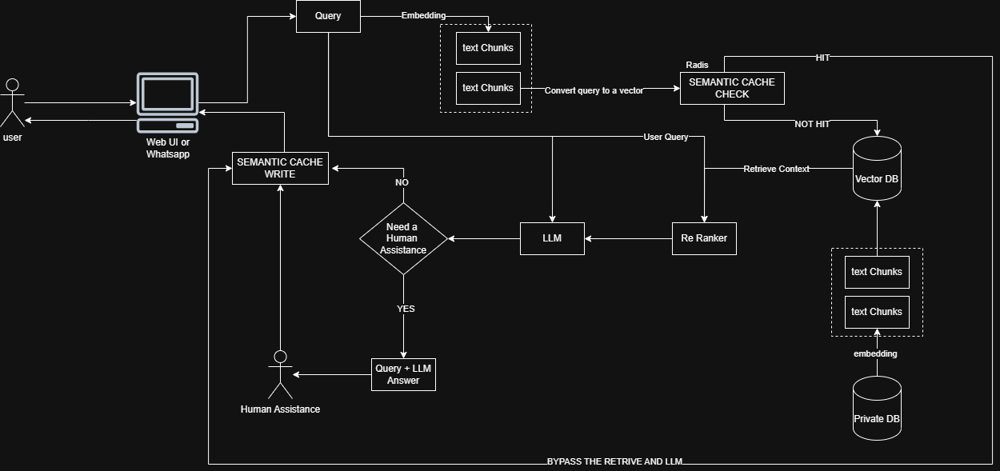

# HelpDesk RAG Chatbot

> **Repository:** https://github.com/omalmaleesha/HelpDesk-RAG-Chatbot



## Project Idea

HelpDesk RAG Chatbot is an AI-powered support assistant built on the **Retrieval-Augmented Generation (RAG)** pattern. Instead of relying on a language model's baked-in knowledge alone, the system first retrieves the most relevant passages from your own document library (PDFs and plain-text files) and then feeds those passages as grounded context to a large language model to produce accurate, source-aware answers.

The core workflow is:
1. **Ingest** – upload your support documents (policies, manuals, FAQs) to the `storage/` folder and call `/documents/load` to chunk, embed, and persist them in a local ChromaDB vector store.
2. **Retrieve** – when a user asks a question, the query is embedded and the top-8 most similar document chunks are fetched from ChromaDB.
3. **Rerank** – a CrossEncoder model scores and reranks those candidates, keeping the top-3 highest-relevance passages.
4. **Generate** – a Groq-hosted LLM (OpenAI-compatible endpoint) synthesises a final answer from the reranked context.
5. **Verify & Escalate** – an automatic similarity check compares the answer against the context; if confidence is below the threshold the question is escalated to a human agent via a Next.js dashboard, which polls for a corrected answer and returns it to the user.
6. **Cache** – answered queries are stored in an in-memory semantic cache so repeat or near-duplicate questions are served instantly without hitting the LLM or vector store again.

## Features

- **Document ingestion** – load `.pdf` and `.txt` files from `storage/`, split into overlapping chunks (size 500 / overlap 100), embed, and persist to on-disk ChromaDB.
- **Semantic search** – cosine-similarity vector retrieval powered by ChromaDB and LangChain-Chroma, returning the top-8 most relevant chunks per query.
- **Cross-encoder reranking** – `cross-encoder/ms-marco-MiniLM-L-6-v2` reranks the retrieved candidates, selecting the top-3 for context.
- **LLM answer generation** – Groq-hosted LLM (`openai/gpt-oss-120b`) generates a grounded answer from the reranked context.
- **Automatic answer verification** – `all-MiniLM-L6-v2` sentence-transformer compares the LLM answer against the context; low-confidence answers are flagged for human review.
- **Human-agent escalation** – low-confidence queries are forwarded to a Next.js human-agent dashboard; the system polls until a corrected answer is submitted, then returns that to the user.
- **Semantic cache** – in-memory cache stores query embeddings and answers; cosine similarity (threshold 0.92) serves cached answers for near-duplicate queries, skipping the LLM entirely.
- **REST API with Swagger UI** – FastAPI exposes `/documents/load`, `/documents/verify`, `/query`, `/human-assist`, and `/human-assist/all`; interactive docs at `http://127.0.0.1:8000/docs`.
- **CORS support** – configured to accept requests from the Next.js human-agent frontend running on `localhost:3000`.
- **Human-agent dashboard** – a Next.js 15 / TypeScript / Tailwind CSS web app where support staff view escalated queries, provide corrected answers, and browse resolution history.

## Tech stack

### Backend (Python 3.12)
| Layer | Technology |
|---|---|
| API framework | **FastAPI** (Swagger UI at `/docs`) |
| Vector store | **ChromaDB** + **LangChain-Chroma** (on-disk persistence) |
| Embeddings | **HuggingFace** `sentence-transformers/all-MiniLM-L6-v2` |
| Reranker | **CrossEncoder** `cross-encoder/ms-marco-MiniLM-L-6-v2` |
| LLM | **Groq** OpenAI-compatible endpoint (`openai/gpt-oss-120b`) |
| Answer verification | **SentenceTransformer** cosine-similarity check |
| Semantic cache | In-memory cosine-similarity cache (threshold 0.92) |
| Document parsing | **pypdf** (PDF), built-in file I/O (TXT) |
| Environment | **python-dotenv**, **uv** (package/lock management) |

### Human-Agent Frontend (Next.js)
| Layer | Technology |
|---|---|
| Framework | **Next.js 15** (App Router) |
| Language | **TypeScript** |
| Styling | **Tailwind CSS** |
| API routes | Next.js Route Handlers (REST escalation endpoints) |

## Prerequisites
- Python 3.12+
- A Groq API key exported as `GROQ_API_KEY`
- Local documents to ingest: place `.pdf` or `.txt` files in `storage/`

## Setup (Windows PowerShell)
```powershell
# From repo root
python -m venv .venv
.\.venv\Scripts\Activate.ps1

# Install dependencies from pyproject.toml
pip install --upgrade pip
pip install chromadb fastapi[standard] groq langchain langchain-chroma langchain-community langchain-huggingface openai pypdf python-dotenv sentence-transformers

# Configure your Groq key
setx GROQ_API_KEY "<your_groq_api_key>"
```

## Run locally
Run from the project root so the `app` package is importable:
```powershell
.\.venv\Scripts\Activate.ps1
uvicorn app.main:app --reload
```
Then open Swagger UI: http://127.0.0.1:8000/docs

### Human agent / chat UI (Next.js)
If you want a simple front-end for document load/verify and a WhatsApp-style chat against `/query`:

```powershell
# In another shell from repo root
cd human-agent
npm install
npm run dev
```

Set `NEXT_PUBLIC_RAG_BASE_URL` if your FastAPI server isn’t on `http://127.0.0.1:8000`.

- **Documents**: triggers `/documents/load` and `/documents/verify`
- **Query**: runs the hybrid retrieval `/query?user_query=...`
- **Chat**: WhatsApp-like interface hitting `/query`, shows loading on send

## How to use via Swagger UI (http://127.0.0.1:8000/docs)
1) **Health check**: `GET /` → returns `{"message": "Hello RAG"}`
2) **Load documents**: `GET /documents/load`
	- Reads all `.pdf`/`.txt` in `storage/`
	- Splits into chunks (size 500, overlap 100)
	- Embeds and writes to on-disk Chroma at `chroma_db/`
3) **Verify ingestion**: `GET /documents/verify` to see counts and sample vectors
4) **Query**: `GET /query?user_query=your question`
	- Retrieves top 8 from Chroma, reranks top 3, builds context, calls Groq LLM
	- If the automatic similarity check flags low confidence, it falls back to a human-agent hook (`app/agents/human_agent.py`)

### Example cURL calls
```powershell
# Load documents
curl "http://127.0.0.1:8000/documents/load"

# Query
curl "http://127.0.0.1:8000/query?user_query=What is in the docs?"
```

## Data & persistence
- Documents source: `storage/`
- Persisted vectors: `chroma_db/`

## Common issues
- `ModuleNotFoundError: No module named 'app'`: run uvicorn **from repo root** (e.g., `uvicorn app.main:app --reload`) or pass `--app-dir .`.
- Missing Groq key: set `GROQ_API_KEY` before starting the server.
